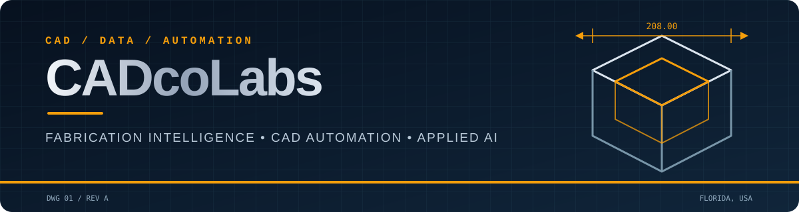

  

  
  

## Built where metal meets software

I work across aluminum fabrication, CAD, software automation, and data. **CADcoLabs** is my workbench for turning real production constraints into tools that make design and engineering work faster, clearer, and more repeatable.

| `01 / CAD & FABRICATION` | `02 / AUTOMATION & INTEGRATION` | `03 / DATA & APPLIED AI` |
| --- | --- | --- |
| Parametric design, CAD APIs, and aluminum fabrication workflows | MCP servers, engineering utilities, and process automation | Python, SQL, Power BI, local models, and practical AI tooling |

## On the workbench

## Toolchain

  
  
  
  
  
  
  
  

---

<strong>Measure twice. Automate the third.</strong>

